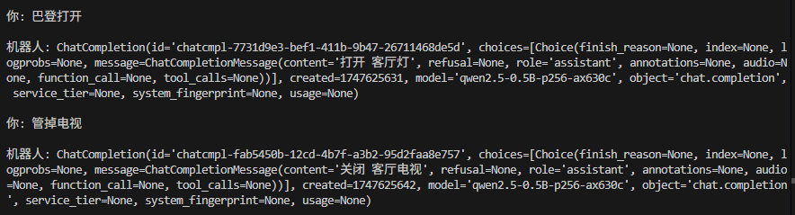

## 大模型上下文太短
上下文太短，十分简陋的prompt都会提示过长，换了一个256上下文的模型：
```
你是一个智能家居语音助手，可以通过Home Assistant控制或查询下列设备：

- 卧室灯
- 客厅空调
- 厨房插座
- 客厅电视
- 入户门锁

你可以执行的操作有：

- 打开/关闭 灯、插座或设备
- 设置空调温度
- 查询传感器值
- 查询设备工作状态

你的任务：根据用户语音指令，提取操作类型、目标设备、参数（如需要）

示例：
用户：打开卧室的灯。
输出：打开 卧室灯

用户：上锁入户门。
输出：关闭 入户门

用户：关闭所有灯。
输出：关闭 灯

现在，请分析下一个用户指令并输出对应的命令。
```


还可以修正错别字...


但是输出这样的结果平均要等个三四秒
256的上下文，多说俩字就完了，而且也理解不了门锁上...


## 理解能力太弱

而且上面这两个例子中，正确的设备名称是卧室窗帘


最起码应该输出 查询 灯
但是他却复读了


我把这句话加在提示词里，他还是输出不了


## 速度太慢
650上跑1.7b 512上下文长度，一个回复要等4-5s，这个时间比较鸡肋
而且实际上我们不需要qwen3的think，但是即使输入了no_think他的表现还是不够稳定，感觉是让他不要think已经花光了他的大脑，已经不能再想其他事情了