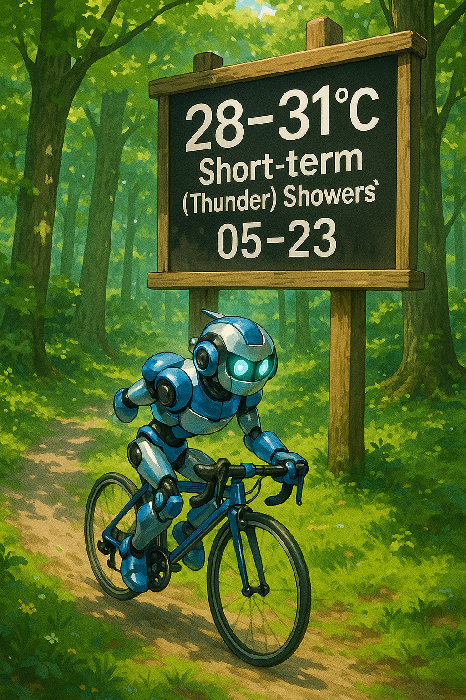
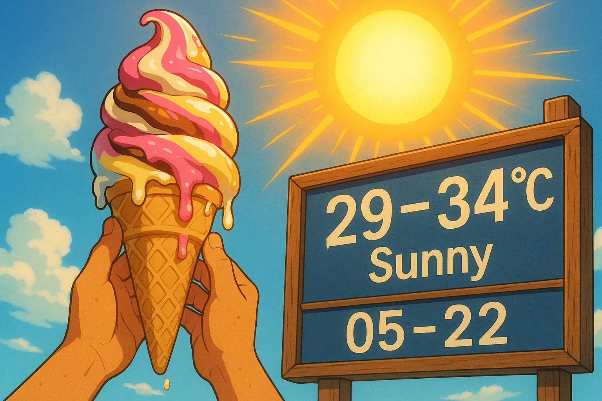
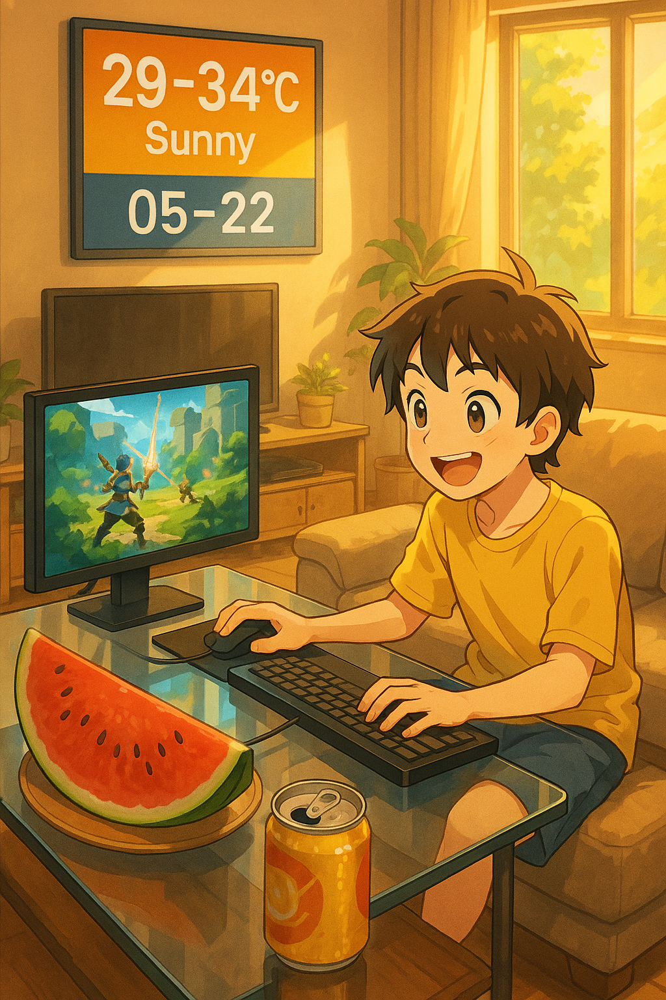

提示词：
```
An anime-style forest scene filled with lush trees and dappled sunlight filtering through the leaves. A cool and energetic robot is riding a sleek bicycle, pedaling fast as it weaves through the forest paths. The robot has a shiny metallic body, with blue and silver accents, and its eyes glow with a bright light. Its limbs move smoothly and rhythmically as it maneuvers around the trees.

In the middle of the forest clearing, there is a large, old - fashioned wooden signpost. On this signpost, large, bold, high - contrast and prominently displayed weather text “28–31°C Short - term (Thunder) Showers” and date “05 - 23” are clearly visible. The text stands out against a black background, making it extremely clear, fully accurate, and highly legible, with no extra text.

The forest floor is covered with a carpet of green moss and fallen leaves, and small wildflowers dot the sides of the path. The air is filled with the fresh scent of pine and the gentle chirping of birds. The sunlight creates long shadows on the ground as the robot speeds by, creating a sense of movement and adventure. The colors in the scene are vivid, with the greens of the forest, the blues and silvers of the robot, and the bold black and white of the signpost creating a visually striking image. The overall mood is one of excitement and exploration as the robot embarks on its journey through the forest. 
```

https://huggingface.co/spaces/NihalGazi/FLUX-Pro-Unlimited
https://huggingface.co/spaces/black-forest-labs/FLUX.1-dev

| 豆包seedream-3-0                           | Unlimited FLUX-Pro<br>                   | FLUX.1 dev<br>                           | gpt-image-4o                            |
| ---------------------------------------- | ---------------------------------------- | ---------------------------------------- | --------------------------------------- |
|  |  |  |  |


```
Anime-style close-up of a sweet girl's eyes, one red pupil and one blue pupil, soft and dreamy lighting. Large, bold, high-contrast and prominently displayed weather text “29–34°C Sunny” and date “05-22” on a small neon sign in the corner of the frame, extremely clear, fully accurate, highly legible, no extra text.
```

| 豆包seedream-3-0                           | Unlimited FLUX-Pro<br>                   | FLUX.1 dev<br>                           | gpt-image-4o                            |
| ---------------------------------------- | ---------------------------------------- | ---------------------------------------- | --------------------------------------- |
|  |  |  |  |


```
An anime-style scene featuring a pair of hands holding up a large, colorful ice cream cone, with the ice cream having various swirls of bright flavors like strawberry, chocolate, and vanilla. The ice cream is dripping slightly, creating a sweet and enticing look. The hands are tanned and have a few freckles, adding a sense of realism to the otherwise cartoonish setting.

Above the ice cream, there is a huge, blazing sun. The sun is depicted as a large, yellow orb with intense rays radiating outwards, giving off a warm and bright glow. The rays are so strong that they seem to be almost tangible, creating a vivid and energetic atmosphere.

In the corner of the scene, there is a big, old - fashioned wooden signpost. On this signpost, large, bold, high - contrast and prominently displayed weather text “29–34°C Sunny” and date “05 - 22” are clearly visible. The text stands out against a deep blue background, making it extremely clear, fully accurate, and highly legible. There is no extra text on the signpost, just the essential weather and date information.

The overall color palette of the scene is dominated by warm tones such as bright yellows, oranges, and reds to represent the sun and the heat of the day. The ice cream adds pops of cool colors like pink, purple, and white, creating a nice contrast. The sky is a clear, bright blue, and there are a few fluffy white clouds floating in the distance, enhancing the sense of a beautiful sunny day. The lighting in the scene is soft and diffused, with the sun being the main light source, casting long shadows on the ground. 

```


| 豆包                                       | gpt                                     |
| ---------------------------------------- | --------------------------------------- |
|  |  |


```
 An anime - style living room scene filled with a warm and lively atmosphere. Soft, bright lighting gives the room a cozy glow. In the center of the room, there is a large, comfortable sofa facing a big - screen TV. A young person is sitting on the sofa, happily playing games on a high - end computer placed on a sleek glass table in front. The computer screen is filled with vivid game graphics, and the person's face is beaming with joy, hands deftly operating the keyboard and mouse.

On the table beside the computer, there is a large, juicy watermelon cut into slices. The red flesh of the watermelon is glistening with moisture, and the black seeds are clearly visible. Next to the watermelon, there is an open can of soda, with tiny bubbles rising from the golden - brown liquid.

On the wall opposite the sofa, there is a large, modern - looking electronic display board. On this board, large, bold, high - contrast and prominently displayed weather text “29–34°C Sunny” and date “05 - 22” are shown. The text is extremely clear, fully accurate, highly legible, and there is no extra text on the board. The colors of the text and the background of the board create a strong visual contrast, making it easy to read from anywhere in the room. The overall scene combines the elements of relaxation, entertainment, and the display of weather and date information in a harmonious and visually appealing way. 

```

| 豆包                                       | gpt                                     |
| ---------------------------------------- | --------------------------------------- |
|  |  |

