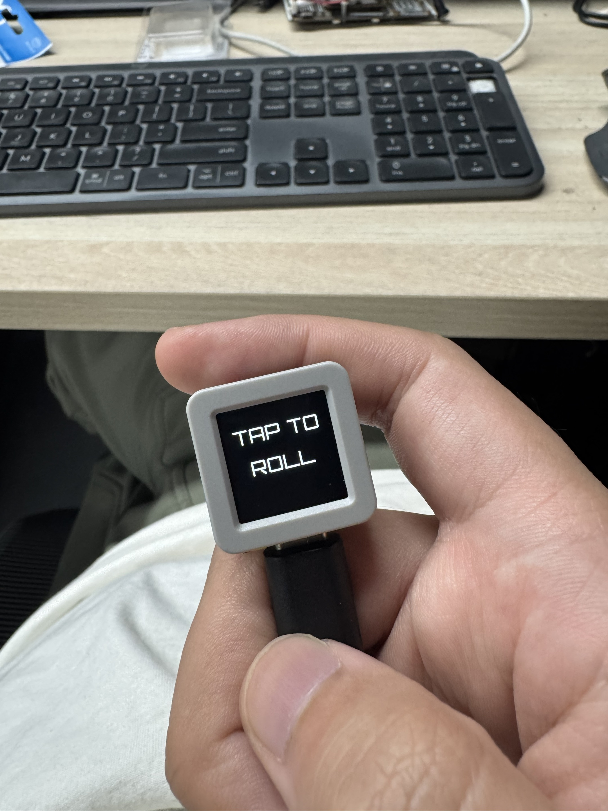
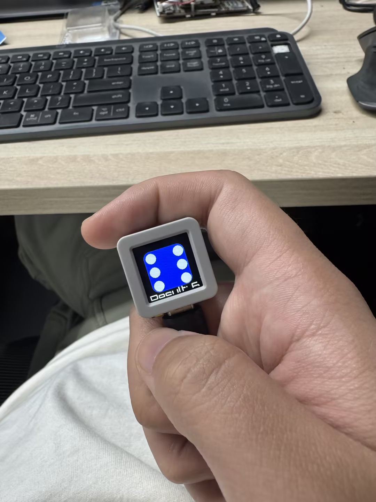
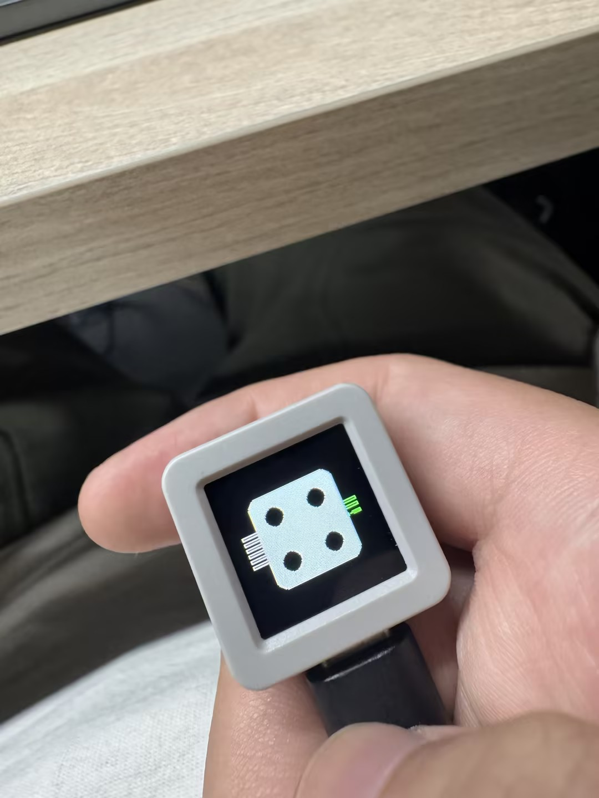
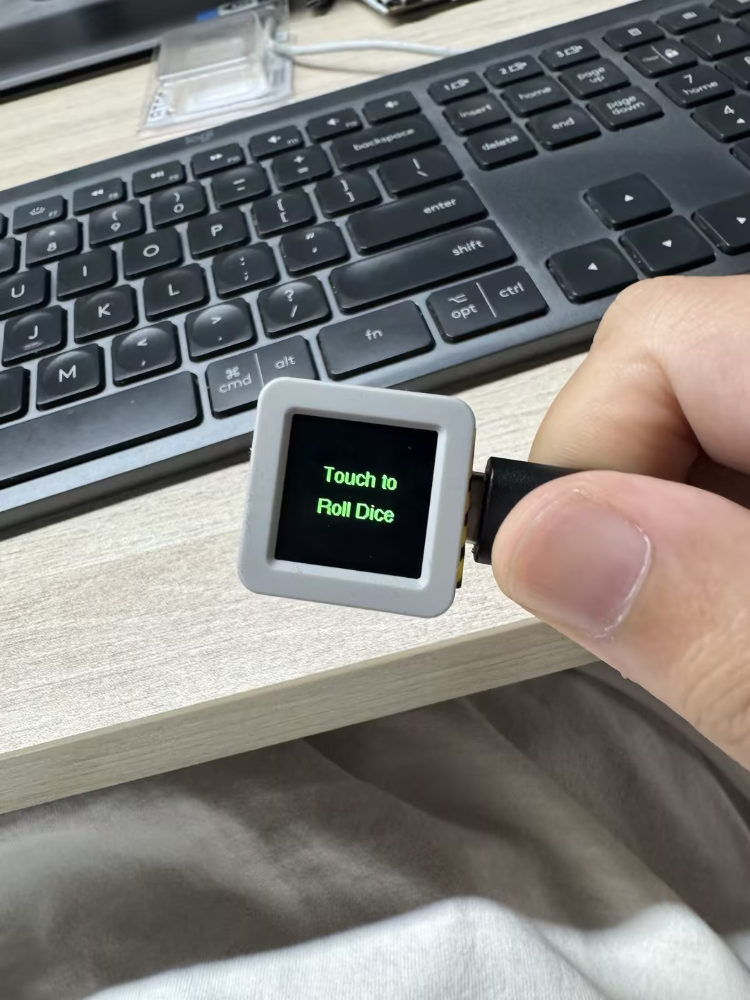
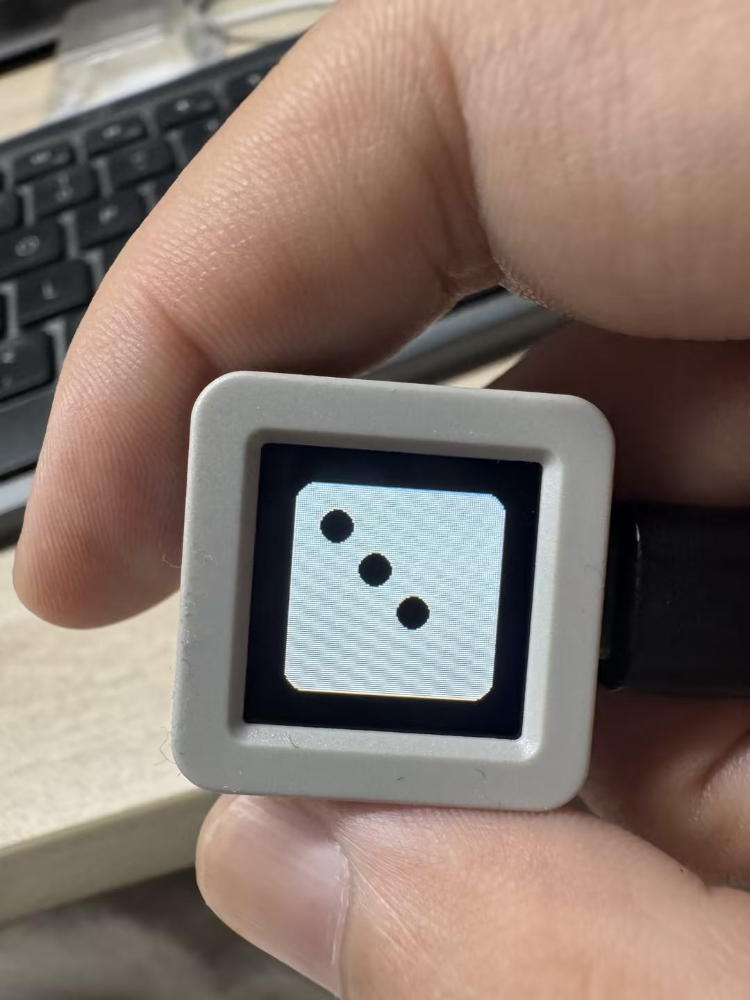

使用atoms3r和unit env pro测试以下几个项目

## 按键+姿态+显示
提示词如下：
现在我已经成功安装好了atoms3r的arduino环境，并且跑通了例程，你给我写一个小项目，内容是按下s3r的屏幕按钮后，就显示一个类似掷骰子的画面，然后过两秒后显示一个投掷结果，往复如此，s3r便成了一个电子骰子
### 结果总览

模型均关闭了思考模式，但是workflow的延迟依然很大，能有3分钟，前面所有子模型均使用deepseek3.2，后期再优化

| 模型                      | 结果                           | 结果                                                                                         |
| ----------------------- | ---------------------------- | ------------------------------------------------------------------------------------------ |
| chatbot                 | 一次编译失败，返回报错后修改编译成功，但底部文字显示不全 |  |
| workflow+gemini3flash   | 一次编译成功且正常运行，但边缘有不明像素条        |  |
| workflow+glm4.7（chat同款） | 一次编译通过，正常运行，但是骰子界面的点数有点偏移    |  |
ai代码评分：
claude: workflow-gemini > workflow-glm > chatbot
gemini: workflow-glm > chatbot > workflow-gemini
gpt: workflow-gemini > workflow-glm > chatbot
具体代码在最末尾


.mp4)
.mp4)
.mp4)


## 外设+姿态+动态曲线显示
提示词如下：
现在我有一个atoms3r和一个unit env pro，你帮我写一个arduino代码，需求如下：1、不断读取温度，湿度，和大气压传感器的数值，绘制一个动态的曲线在atoms3r上，温度为红色，湿度为蓝色，大气压为黄色；2、当我剧烈摇晃atom的时候，屏幕清空，三条曲线都重新开始绘制


| 模型           |                                               |                                               |
| ------------ | --------------------------------------------- | --------------------------------------------- |
| chatbot      | 第一次编译报错，修正后编译通过，但是选择的颜色错误，并且湿度的颜色基本看不清；摇晃检测正常 |  |
| wrokflow+glm | 一次编译通过，但是没有显示黄色的气压条，颜色正常，摇晃检测正常               |  |


## 外设+按键+姿态+动态复杂曲线显示
提示词如下：
现在我有一个atoms3r和一个unit env pro，你帮我写一个arduino代码，需求如下：1、不断读取温度，湿度，和大气压传感器的数值，绘制一个动态的曲线在atoms3r上，温度为红色，湿度为蓝色，大气压为黄色；2、我需要三条曲线都是透明的，由于可能会互相遮挡，所以用不同透明程度的颜色填空他们所属的区域 3、我需要可以实时看到数值，不能仅仅显示曲线；4、当我剧烈摇晃atom或者按下屏幕的时候，屏幕清空，三条曲线都重新开始绘制 

|         |                             |
| ------- | --------------------------- |
| chatbot | 编译报错一次，修改后依然报错，都是关于颜色绘制的，放弃 |
|         |                             |

# 代码
## 骰子
#### chatbot详细结果
回复的代码如下：
```C++
#include <M5Unified.h>

// 定义骰子点阵数据 (3x3 矩阵, 1代表有点, 0代表无)
// 顺序对应点数 1 到 6
const byte dicePatterns[6][9] = {
    {0, 0, 0, 0, 1, 0, 0, 0, 0}, // 1
    {1, 0, 0, 0, 0, 0, 0, 0, 1}, // 2
    {1, 0, 0, 0, 1, 0, 0, 0, 1}, // 3
    {1, 0, 1, 0, 0, 0, 1, 0, 1}, // 4
    {1, 0, 1, 0, 1, 0, 1, 0, 1}, // 5
    {1, 0, 1, 1, 0, 1, 1, 0, 1}  // 6
};

// 骰子绘制参数
const int diceX = 14;      // 骰子左上角 X 坐标
const int diceY = 14;      // 骰子左上角 Y 坐标
const int diceSize = 100;  // 骰子边长
const int dotRadius = 12;  // 点的半径
const int gap = 34;        // 点之间的间距

void setup() {
    auto cfg = M5.config();
    M5.begin(cfg); // 初始化 M5AtomS3R
    
    // 设置屏幕显示属性
    M5.Display.setTextColor(TFT_WHITE);
    M5.Display.setTextDatum(middle_center); // 文字居中
    M5.Display.setTextPadding(128);         // 文字背景宽度，用于覆盖旧文字
    
    showIdleScreen(); // 显示初始画面
}

void loop() {
    M5.update(); // 必须调用，用于更新按键和触摸状态

    // 检测屏幕是否被点击 (BtnA 对应 AtomS3R 的屏幕触摸)
    if (M5.BtnA.wasClicked()) {
        startRolling(); // 开始投掷流程
    }
}

// 显示待机画面
void showIdleScreen() {
    M5.Display.fillScreen(TFT_BLACK);
    M5.Display.setFont(&fonts::Orbitron_Light_24);
    M5.Display.drawString("TAP TO", M5.Display.width() / 2, 30);
    M5.Display.drawString("ROLL", M5.Display.width() / 2, 70);
}

// 投掷流程控制
void startRolling() {
    unsigned long startTime = millis();
    unsigned long animationInterval = 100; // 动画刷新间隔
    unsigned long lastAnimTime = 0;
    int randomNum = 1;

    // 动画阶段：持续 2000 毫秒
    while (millis() - startTime < 2000) {
        M5.update(); // 持续更新状态，防止看门狗复位
        
        // 每隔一段时间刷新一次随机数
        if (millis() - lastAnimTime > animationInterval) {
            randomNum = random(1, 7); // 生成 1-6 的随机数
            drawDiceFace(randomNum, TFT_BLUE); // 绘制骰子（蓝色背景）
            lastAnimTime = millis();
        }
    }

    // 结果阶段：显示最终结果
    int finalNum = random(1, 7);
    drawDiceFace(finalNum, TFT_GREEN); // 绘制最终骰子（绿色背景）
    
    // 在下方显示数字结果
    M5.Display.setFont(&fonts::Orbitron_Light_24);
    M5.Display.setTextColor(TFT_WHITE);
    M5.Display.drawString("Result: " + String(finalNum), M5.Display.width() / 2, 125);
}

// 绘制骰子面
// num: 点数 (1-6)
// color: 骰子背景颜色
void drawDiceFace(int num, uint32_t color) {
    // 1. 清屏并绘制骰子底色方块
    M5.Display.fillScreen(TFT_BLACK);
    M5.Display.fillRoundRect(diceX, diceY, diceSize, diceSize, 16, color);

    // 2. 绘制点
    M5.Display.fillCircle(TFT_WHITE); // 设置画笔颜色为白色
    
    // 遍历 3x3 矩阵
    for (int i = 0; i < 9; i++) {
        if (dicePatterns[num - 1][i] == 1) {
            int row = i / 3;
            int col = i % 3;
            // 计算点的圆心坐标
            int cx = diceX + gap / 2 + col * gap;
            int cy = diceY + gap / 2 + row * gap;
            M5.Display.drawCircle(cx, cy, dotRadius); // 画圆
        }
    }
}

```
编译报错：
```c
C:\Users\Admin\AppData\Local\Temp\.arduinoIDE-unsaved2026023-32292-5mrp0h.whdfp\sketch_jan23a\sketch_jan23a.ino: In function 'void drawDiceFace(int, uint32_t)':
C:\Users\Admin\AppData\Local\Temp\.arduinoIDE-unsaved2026023-32292-5mrp0h.whdfp\sketch_jan23a\sketch_jan23a.ino:88:26: error: no matching function for call to 'm5gfx::M5GFX::fillCircle(const int&)'
In file included from c:\Users\Admin\Documents\Arduino\libraries\M5GFX\src/M5GFX.h:50,
                 from c:\Users\Admin\Documents\Arduino\libraries\M5Unified\src/M5Unified.hpp:19,
                 from c:\Users\Admin\Documents\Arduino\libraries\M5Unified\src/M5Unified.h:5,
                 from C:\Users\Admin\AppData\Local\Temp\.arduinoIDE-unsaved2026023-32292-5mrp0h.whdfp\sketch_jan23a\sketch_jan23a.ino:1:
c:\Users\Admin\Documents\Arduino\libraries\M5GFX\src/lgfx/v1/LGFXBase.hpp:226:24: note: candidate: 'template<class T> void lgfx::v1::LGFXBase::fillCircle(int32_t, int32_t, int32_t, const T&)'
  226 |     LGFX_INLINE_T void fillCircle      ( int32_t x, int32_t y                      , int32_t r, const T& color) { setColor(color); fillCircle   (x, y      , r); }
      |                        ^~~~~~~~~~
c:\Users\Admin\Documents\Arduino\libraries\M5GFX\src/lgfx/v1/LGFXBase.hpp:226:24: note:   candidate expects 4 arguments, 1 provided
c:\Users\Admin\Documents\Arduino\libraries\M5GFX\src/lgfx/v1/LGFXBase.hpp:227:24: note: candidate: 'void lgfx::v1::LGFXBase::fillCircle(int32_t, int32_t, int32_t)'
  227 |                   void fillCircle      ( int32_t x, int32_t y                      , int32_t r);
      |                        ^~~~~~~~~~
c:\Users\Admin\Documents\Arduino\libraries\M5GFX\src/lgfx/v1/LGFXBase.hpp:227:24: note:   candidate expects 3 arguments, 1 provided
Using library M5Unified at version 0.2.11 in folder: C:\Users\Admin\Documents\Arduino\libraries\M5Unified 
Using library M5GFX at version 0.2.18 in folder: C:\Users\Admin\Documents\Arduino\libraries\M5GFX 
exit status 1

Compilation error: no matching function for call to 'm5gfx::M5GFX::fillCircle(const int&)'
```
消息发送给chatbot后再次回复后编译通过

#### workflow+gemini结果
```c++
#include <M5Unified.h>

// 定义状态
enum DiceState {
    IDLE,      // 等待投掷
    ROLLING,   // 投掷动画中
    RESULT     // 显示结果
};

DiceState currentState = IDLE;
unsigned long animationStartTime = 0;
int lastNumber = 1;

// 骰子点数位置定义 (基于 80x80 的骰子框)
void drawDiceDots(int number, int x, int y, int size) {
    int r = size / 10; // 点的半径
    int m = size / 4;  // 边距间隔
    uint16_t color = TFT_BLACK;

    // 根据数字绘制圆点
    if (number == 1 || number == 3 || number == 5)
        M5.Display.fillCircle(x + size/2, y + size/2, r, color); // 中心
    if (number >= 2) {
        M5.Display.fillCircle(x + m, y + m, r, color);           // 左上
        M5.Display.fillCircle(x + size - m, y + size - m, r, color); // 右下
    }
    if (number >= 4) {
        M5.Display.fillCircle(x + size - m, y + m, r, color);    // 右上
        M5.Display.fillCircle(x + m, y + size - m, r, color);    // 左下
    }

    if (number == 6) {
        M5.Display.fillCircle(x + m, y + size/2, r, color);      // 左中
        M5.Display.fillCircle(x + size - m, y + size/2, r, color); // 右中
    }
}

// 绘制完整的骰子背景和点数
void drawDice(int number) {
    int size = 80;
    int x = (M5.Display.width() - size) / 2;
    int y = (M5.Display.height() - size) / 2;

    // 绘制圆角矩形骰子背景
    M5.Display.fillRoundRect(x, y, size, size, 10, TFT_WHITE);
    M5.Display.drawRoundRect(x, y, size, size, 10, TFT_SILVER);
    drawDiceDots(number, x, y, size);
}

  
void setup() {
    auto cfg = M5.config();
    M5.begin(cfg);

    // 初始化随机数种子（读取模拟引脚噪声）
    randomSeed(micros());
    M5.Display.setRotation(1);
    M5.Display.fillScreen(TFT_BLACK);
    M5.Display.setTextDatum(middle_center);
    M5.Display.setFont(&fonts::FreeSansBold9pt7b);
    M5.Display.drawString("按下屏幕投掷", M5.Display.width() / 2, 20);
    drawDice(1); // 默认显示1
}

  

void loop() {

    M5.update(); // 必须调用以更新按键状态
    switch (currentState) {

        case IDLE:
            // 检测按键按下
            if (M5.BtnA.wasPressed()) {
                currentState = ROLLING;
                animationStartTime = millis();
                M5.Display.fillScreen(TFT_BLACK);
                M5.Display.drawString("投掷中...", M5.Display.width() / 2, 20);
            }
            break;
        case ROLLING:
            // 播放2秒动画，每100ms变换一次数字
            if (millis() - animationStartTime < 2000) {
                int tempNum = random(1, 7);
                drawDice(tempNum);
                delay(100);
            } else {
                currentState = RESULT;
                lastNumber = random(1, 7); // 生成最终结果
            }
            break;
        case RESULT:
            M5.Display.fillScreen(TFT_BLACK);
            M5.Display.setTextColor(TFT_GREEN);
            M5.Display.drawString("结果!", M5.Display.width() / 2, 20);
            drawDice(lastNumber);
            M5.Display.setTextColor(TFT_WHITE);
            M5.Display.drawString("再次按下重来", M5.Display.width() / 2, 110);
            currentState = IDLE;
            break;
    }
}
```
一次编译通过

#### workflow+glm
```c
/*
 * M5AtomS3R 电子骰子项目
 * 功能：
 * 1. 初始显示提示信息
 * 2. 触摸屏幕后播放骰子滚动动画
 * 3. 2秒后显示随机结果 (1-6)
 * 4. 循环往复
 */

#include <M5Unified.h>
// 定义骰子点数图案 (基于 5x5 网格坐标)
// 每个点数对应一组 {x, y} 坐标
const uint8_t dicePatterns[6][6][2] = {
  { {2, 2} },                                     // 1点: 中心
  { {1, 1}, {3, 3} },                             // 2点: 左上, 右下
  { {1, 1}, {2, 2}, {3, 3} },                     // 3点: 左上, 中心, 右下
  { {1, 1}, {1, 3}, {3, 1}, {3, 3} },             // 4点: 四角
  { {1, 1}, {1, 3}, {2, 2}, {3, 1}, {3, 3} },     // 5点: 四角 + 中心
  { {1, 1}, {1, 2}, {1, 3}, {3, 1}, {3, 2}, {3, 3} } // 6点: 两列
};


const int patternCounts[6] = {1, 2, 3, 4, 5, 6}; // 每个点数的圆点数量

// 动画控制变量
bool isRolling = false;
unsigned long rollStartTime = 0;
const unsigned long ROLL_DURATION = 2000; // 动画持续时间 2000ms (2秒)
int finalResult = 1;

void setup() {
  // 自动配置 AtomS3R (包含屏幕、触摸、电源等初始化)
  auto cfg = M5.config();
  M5.begin(cfg);
  // 设置屏幕方向 (AtomS3R 通常默认为 1 或 3，根据实际观看调整)
  M5.Display.setRotation(1);
  // 显示初始欢迎界面
  showWelcomeScreen();
}

  
void loop() {
  M5.update(); // 必须调用，用于更新按钮和触摸状态

  // 检测屏幕触摸 (BtnA 代表整个触摸区域)
  if (M5.BtnA.wasPressed()) {
    if (!isRolling) {
      startDiceRoll();
    }
  }

  // 处理动画逻辑
  if (isRolling) {
    unsigned long currentTime = millis();
    unsigned long elapsedTime = currentTime - rollStartTime;

    if (elapsedTime < ROLL_DURATION) {

      // 动画阶段：快速切换随机图案模拟滚动
      // 每 100ms 切换一次画面
      if (elapsedTime % 100 < 20) {
        int tempFace = random(1, 7);
        drawDiceFace(tempFace, true); // true 表示正在滚动
      }
    } else {
      // 时间到，显示最终结果
      isRolling = false;
      drawDiceFace(finalResult, false); // false 表示最终结果
      // 显示结果 2秒后返回欢迎界面，或者直接停留在结果等待下一次点击
      // 这里我们为了符合“往复如此”的需求，停留 2 秒后重置
      delay(2000);
      showWelcomeScreen();
    }
  }
}

// 开始掷骰子
void startDiceRoll() {
  isRolling = true;
  rollStartTime = millis();
  finalResult = random(1, 7); // 预先生成 1-6 的随机结果
}

// 绘制骰子面
// value: 1-6
// isRolling: true=动画帧(背景灰), false=结果帧(背景黑)

void drawDiceFace(int value, bool isRolling) {
  int index = value - 1;
  if (index < 0 || index > 5) return;

  int w = M5.Display.width();
  int h = M5.Display.height();
  // 计算骰子绘制区域 (屏幕的 80%)
  int diceSize = min(w, h) * 0.8;
  int xOffset = (w - diceSize) / 2;
  int yOffset = (h - diceSize) / 2;

  // 计算圆点大小和网格间距
  int dotRadius = diceSize / 12;
  int gridSize = diceSize / 5;

  // 1. 清屏
  M5.Display.fillScreen(isRolling ? TFT_DARKGREY : TFT_BLACK);

  // 2. 绘制骰子底色 (圆角矩形)
  M5.Display.fillRoundRect(xOffset, yOffset, diceSize, diceSize, diceSize/10, TFT_WHITE);
  M5.Display.drawRoundRect(xOffset, yOffset, diceSize, diceSize, diceSize/10, TFT_LIGHTGREY);

  // 3. 绘制点数
  for (int i = 0; i < patternCounts[index]; i++) {
    int gridX = dicePatterns[index][i][0];
    int gridY = dicePatterns[index][i][1];
    // 映射坐标到实际像素位置
    int dotX = xOffset + gridX * gridSize;
    int dotY = yOffset + gridY * gridSize;
    M5.Display.fillCircle(dotX, dotY, dotRadius, TFT_BLACK);
  }

  // 4. 如果是动画状态，显示文字提示
  if (isRolling) {
    M5.Display.setTextColor(TFT_ORANGE);
    M5.Display.setTextDatum(middle_center);
    M5.Display.setFont(&fonts::Font0);
    M5.Display.drawString("Rolling...", w / 2, h - 10);
  }
}

// 显示欢迎界面
void showWelcomeScreen() {
  M5.Display.fillScreen(TFT_BLACK);
  M5.Display.setTextColor(TFT_GREEN);
  M5.Display.setTextDatum(middle_center);
  // 使用合适的字体
  M5.Display.setFont(&fonts::FreeSans9pt7b);
  M5.Display.drawString("Touch to", M5.Display.width() / 2, M5.Display.height() / 2 - 15);
  M5.Display.drawString("Roll Dice", M5.Display.width() / 2, M5.Display.height() / 2 + 15);
}
```


## 外设
#### chatbot代码
```c

#include <M5Unified.h>
#include <M5UnitUnified.h>
#include <M5UnitUnifiedENV.h>

// 使用 UnitENVPro 类
m5::unit::UnitENVPro unitENV;
m5::unit::UnitUnified Units;

// 曲线配置
const int maxDataPoints = 128; // AtomS3R 屏幕宽度为128
float tempHistory[maxDataPoints];
float humHistory[maxDataPoints];
float presHistory[maxDataPoints];

// 显示范围配置
const float tempMin = 0.0;
const float tempMax = 50.0;
const float humMin = 0.0;
const float humMax = 100.0;
const float presMin = 900.0;
const float presMax = 1100.0;

// 摇晃检测阈值
const float shakeThreshold = 2.5; 

void setup() {
    auto cfg = M5.config();
    // 移除了 cfg.imu_auto_update = true; 这一行，因为该配置项不存在
    // M5Unified 会自动初始化 IMU，无需额外配置开启
    
    M5.begin(cfg);

    Serial.begin(115200);
    
    // 初始化屏幕
    M5.Display.setRotation(1); 
    M5.Display.fillScreen(TFT_BLACK);
    M5.Display.setFont(&fonts::lgfxJapanMinchoP_12);

    // 初始化 I2C (Port A)
    auto pin_num_sda = M5.getPin(m5::pin_name_t::port_a. // 注意：新版API可能需要 port_a_sda
    auto pin_num_scl = M5.getPin(m5::pin_name_t::port_a_scl);
    Wire.begin(pin_num_sda, pin_num_scl, 400000U);

    // 添加并启动 Unit ENV Pro
    if (!Units.add(unitENV, Wire) || !Units.begin()) {
        Serial.println("Failed to begin Unit ENV Pro");
        M5.Display.setTextColor(TFT_RED);
        M5.Display.drawString("ENV Error", 0, 0);
        while (true) { delay(1000); }
    }

    resetData();
}

void resetData() {
    for (int i = 0; i < maxDataPoints; i++) {
        tempHistory[i] = 25.0;
        humHistory[i] = 50.0;
        presHistory[i] = 1000.0;
    }
}

void loop() {
    M5.update();
    Units.update();

    // 1. 检测摇晃
    if (M5.Imu.isEnabled()) {
        float accX, accY, accZ;
        // 修正：传入指针参数
        M5.Imu.getAccel(&accX, &accY, &accZ);
        
        float accMagnitude = sqrt(accX * accX + accY * accY + accZ * accZ);
        
        if (accMagnitude > shakeThreshold) {
            resetData();
            M5.Display.fillScreen(TFT_BLACK);
            Serial.println("Shake detected! Resetting graph.");
            delay(500); 
        }
    }

    // 2. 读取传感器数据
    if (unitENV.updated()) {
        float temp = unitENV.temperature();
        float hum = unitENV.humidity();
        float pres = unitENV.pressure() / 100.0; 

        // 数据移位
        for (int i = 0; i < maxDataPoints - 1; i++) {
            tempHistory[i] = tempHistory[i + 1];
            humHistory[i] = humHistory[i + 1];
            presHistory[i] = presHistory[i + 1];
        }
        tempHistory[maxDataPoints - 1] = temp;
        humHistory[maxDataPoints - 1] = hum;
        presHistory[maxDataPoints - 1] = pres;

        drawGraph();
    }

    delay(50); 
}

void drawGraph() {
    drawLine(tempHistory, tempMin, tempMax, TFT_RED, 0);
    drawLine(humHistory, humMin, humMax, TFT_BLUE, 40);
    drawLine(presHistory, presMin, presMax, TFT_YELLOW, 80);
}

void drawLine(float* data, float minVal, float maxVal, uint32_t color, int yOffset) {
    int height = 40; 
    int width = maxDataPoints;
    
    M5.Display.setTextColor(color);
    M5.Display.setCursor(0, yOffset);
    if (color == TFT_RED) M5.Display.print("T:");
    else if (color == TFT_BLUE) M5.Display.print("H:");
    else if (color == TFT_YELLOW) M5.Display.print("P:");

    for (int x = 0; x < width - 1; x++) {
        int floatY1 = map(data[x], minVal, maxVal, yOffset + height, yOffset);
        int floatY2 = map(data[x + 1], minVal, maxVal, yOffset + height, yOffset);
        
        floatY1 = constrain(floatY1, yOffset, yOffset + height);
        floatY2 = constrain(floatY2, yOffset, yOffset + height);

        M5.Display.drawLine(x, floatY1, x + 1, floatY2, color);
    }
}

```


#### workflow + gemini


#### workflow + glm
```c
#include <M5Unified.h>

#include <M5UnitUnified.h>

#include <M5UnitUnifiedENV.h>

  

// 实例化对象

m5::unit::UnitUnified Units;

m5::unit::UnitENVPro unit;

  

// 屏幕与画布配置

M5Canvas canvas(&M5.Display);

const int graphHeight = 120; // 曲线区域高度

const int graphWidth = 128;  // AtomS3R 屏幕宽度

int xPos = 0;                // 当前绘图的 X 轴位置

  

// 阈值定义：用于检测剧烈摇晃

const float SHAKE_THRESHOLD = 2.5; // 加速度阈值 (g)

  

void setup() {

    M5.begin();

    M5.Display.clear();

    // 初始化 Unit ENV Pro (Port A)

    auto pin_num_sda = M5.getPin(m5::pin_name_t::port_a_sda);

    auto pin_num_scl = M5.getPin(m5::pin_name_t::port_a_scl);

    Wire.end();

    Wire.begin(pin_num_sda, pin_num_scl, 400000U);

    if (!Units.add(unit, Wire) || !Units.begin()) {

        M5.Display.println("ENV Unit Init Failed");

        while (true) { delay(1000); }

    }

  

    // 创建画布 (用于缓冲绘图，防止闪烁)

    canvas.createSprite(graphWidth, graphHeight);

    canvas.fillSprite(TFT_BLACK); // 黑色背景

    // 初始文字提示

    M5.Display.setTextColor(TFT_WHITE);

    M5.Display.setTextSize(1);

    M5.Display.setCursor(0, 0);

    M5.Display.println("ENV Monitor");

}

  

void loop() {

    M5.update();

    Units.update();

  

    // --- 1. 检测剧烈摇晃 (清空屏幕逻辑) ---

    // 注意：AtomS3R 内置 IMU，使用 M5.Imu 访问

    if (M5.Imu.update()) {

        auto imuData = M5.Imu.getImuData();

        float ax = abs(imuData.accel.x);

        float ay = abs(imuData.accel.y);

        float az = abs(imuData.accel.z);

        // 如果任一轴加速度超过阈值，判定为剧烈摇晃

        if (ax > SHAKE_THRESHOLD || ay > SHAKE_THRESHOLD || az > SHAKE_THRESHOLD) {

            xPos = 0; // 重置 X 轴

            canvas.fillSprite(TFT_BLACK); // 清空画布

            M5.Display.fillRect(0, 10, graphWidth, graphHeight, TFT_BLACK); // 清空屏幕显示区域

            delay(500); // 简单防抖，避免连续触发

        }

    }

  

    // --- 2. 读取传感器数据并绘制曲线 ---

    if (unit.updated()) {

        // 获取数据

        float temp = unit.temperature();     // 温度

        float humi = unit.humidity();        // 湿度

        float pres = unit.pressure();        // 大气压

  

        // --- 数据映射到屏幕 Y 坐标 ---

        // 温度映射: 假设范围 0~50°C -> 映射到 0~graphHeight

        int yTemp = map((int)(temp * 10), 0, 500, graphHeight, 0);

        // 湿度映射: 0~100% -> 映射到 0~graphHeight

        int yHumi = map((int)humi, 0, 100, graphHeight, 0);

        // 大气压映射: 假设范围 900~1100 hPa -> 映射到 0~graphHeight

        int yPres = map((int)pres, 90000, 110000, graphHeight, 0); // pressure返回Pa，需注意范围

  

        // 限制坐标在画布范围内

        yTemp = constrain(yTemp, 0, graphHeight - 1);

        yHumi = constrain(yHumi, 0, graphHeight - 1);

        yPres = constrain(yPres, 0, graphHeight - 1);

  

        // --- 绘制逻辑 ---

        // 在画布上绘制竖线，或者绘制点。这里为了简单且不覆盖历史，绘制竖线段

        // 如果是 x=0，画点；否则画线连接上一个点（简化处理：直接画单像素竖线或点）

        // 为了实现动态滚动效果，我们通常需要存储上一个点的值。

        // 这里使用简化的“示波器”模式：直接在当前位置画点，x轴递增

        canvas.drawPixel(xPos, yTemp, TFT_RED);    // 温度：红色

        canvas.drawPixel(xPos, yHumi, TFT_BLUE);   // 湿度：蓝色

        canvas.drawPixel(xPos, yPres, TFT_YELLOW); // 大气压：黄色

  

        // 将画布推送到屏幕 (从屏幕顶部下方 10px 处开始)

        canvas.pushSprite(0, 10);

  

        // 更新 X 轴位置

        xPos++;

        if (xPos >= graphWidth) {

            xPos = 0;

            // 如果需要滚动效果，这里可以将画布内容左移，但为了性能和代码简洁，

            // 这里采用“刷新覆盖”模式：x回到0时，旧的曲线会被新曲线覆盖。

            // 若想完全清空重新开始，取消下面注释：

            // canvas.fillSprite(TFT_BLACK);

        }

    }

    delay(10); // 控制循环速度

}
```

