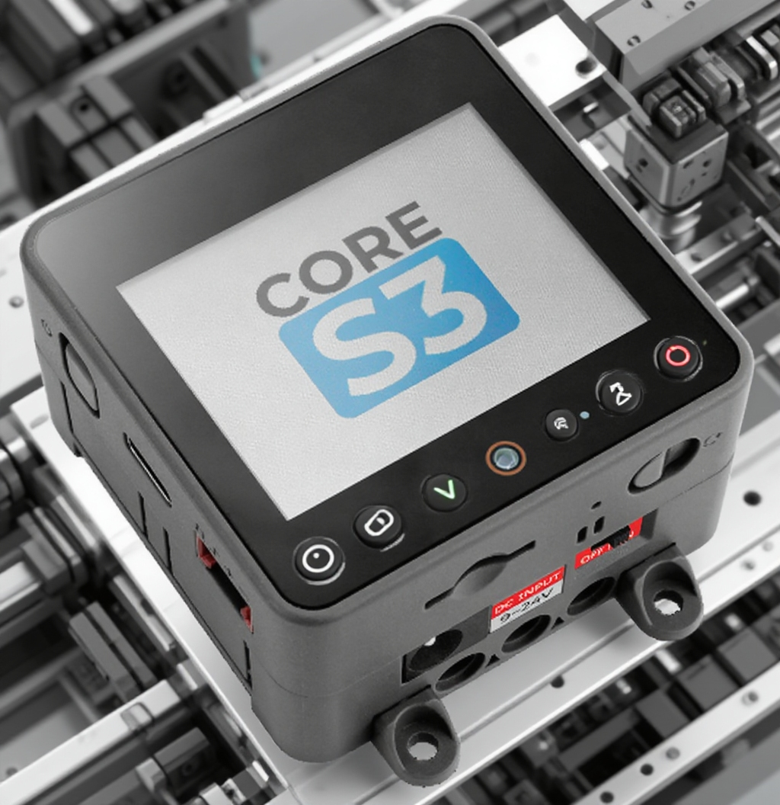
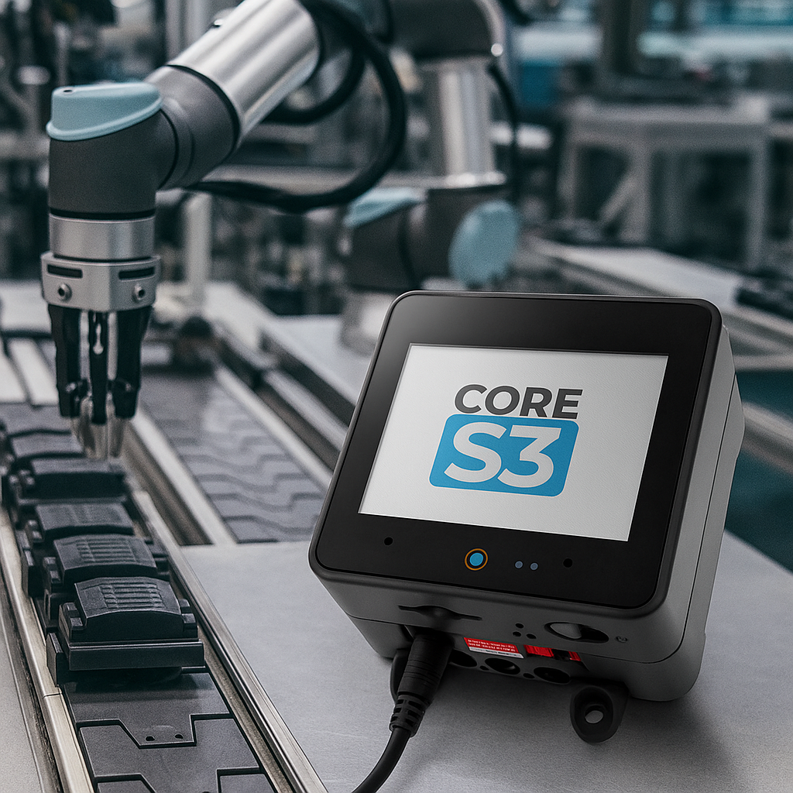
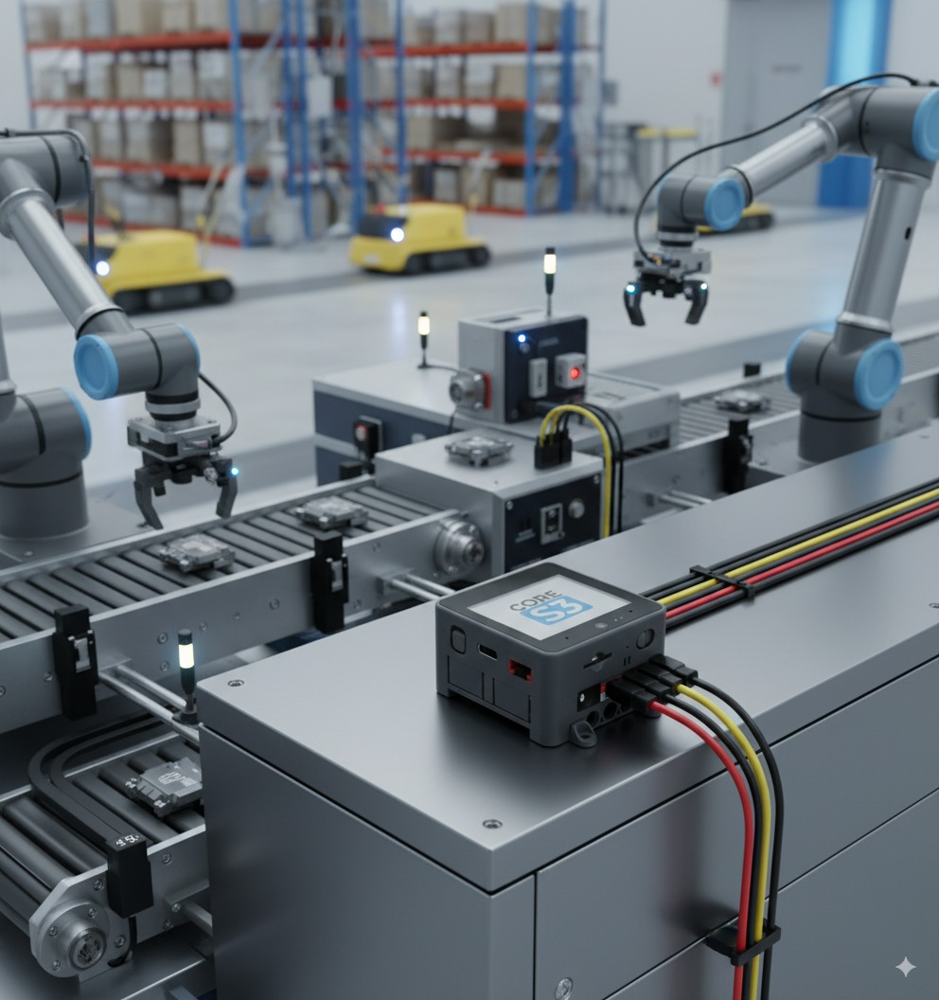
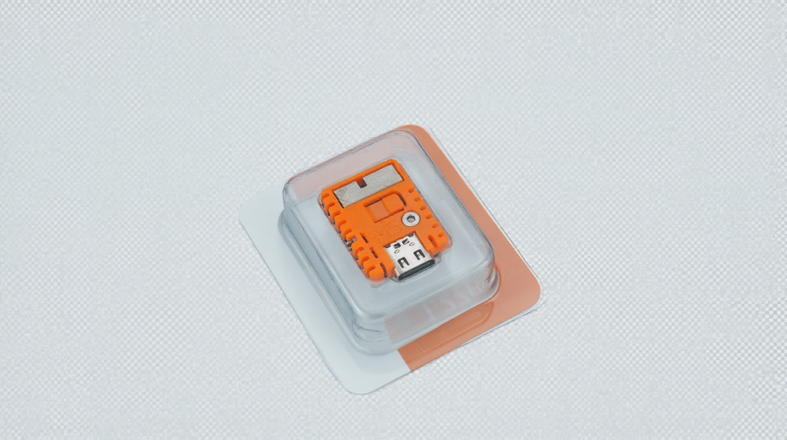
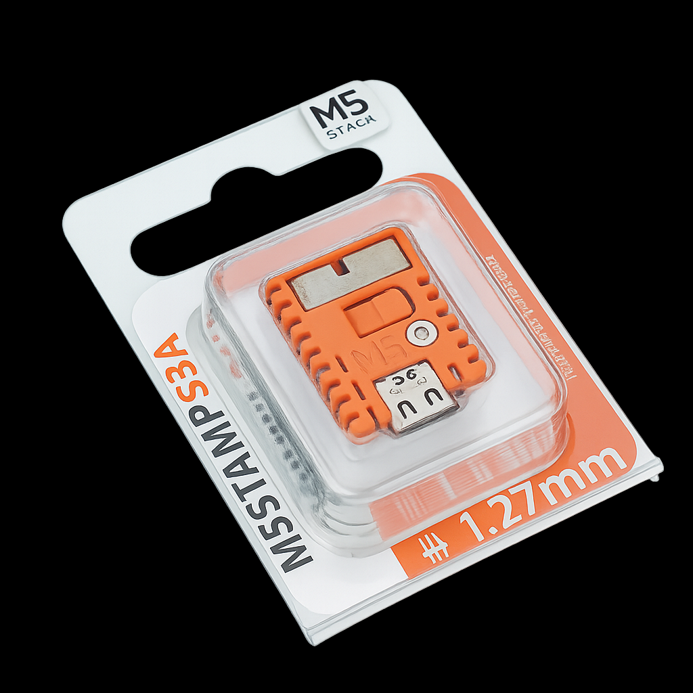

# 主机类设备生成背景融合图
提示词：
生成一张这个产品的产品图，要求不要改变产品的外观，生产场景，有一个小控制器，在控制着智能工业化的机器，接入这个小控制器，这个控制器可以控制这些智能工业的机器，要有自动化的机器场景，与机器结合，融入的自然一点，比例3:2

输入产品图：


| gemini-2.5-flash-image-preview                   | 豆包                            | gpt4o                                  |
| ------------------------------------------------ | ----------------------------- | -------------------------------------- |
|  |  |  |
gemini胜出，提示词加入尺寸后再次生成：

比例也正常了


# 产品抠图
输入prompt：
帮我把图中这个产品图抠出来，变成透明底，要求产品外观和图片保持一直，可以适当提亮增强观感
输入图片


| gemini                                   | 豆包                     | 4o                             |
| ---------------------------------------- | ---------------------- | ------------------------------ |
|  |  |  |


# 风格融合
输入图片：

提示词：
**你是一名荷兰插画师，假设右图是你绘制的花卉，现在我作为甲方请你将左侧的九个Q版形象与右侧郁金香花束结合，要求重新绘制一幅同系列的郁金香花束，色彩以蓝紫为主，黄粉为辅，Q版形象可以生动活泼地穿插在花束中或者花心里，此外可以加入一些荷兰地域特色比如风车等，整体艺术风格必须还原右侧花卉插画的画风，请给出五张左右的创意图供我选择，谢谢**

效果

| Gemini                                   | GPT                                      |
| ---------------------------------------- | ---------------------------------------- |
|  |  |
|  |  |
效果差不多，Gemini的外观保持略好于gpt，但是他俩对于产品数量的把控都有点问题


# 电商产品图生成
**以图1产品为主体，帮我生成图2风格的亚马逊场景图，环境道具可以是物联网操作工具或办公文具，不添加文字，要求活力氛围感**


| Gemini                                   | GPT                                      |
| ---------------------------------------- | ---------------------------------------- |
|  |  |
|  |  |

gemini效果更好，但是感觉融合的不自然，简单修一下提示词：
```
以图1产品为主体，帮我生成图2风格的亚马逊场景图，并且修改周围的环境道具，可以是物联网操作工具或办公文具，不添加文字，要求活力氛围感，超高清图片，产品清晰可见，并且注意各个物件的协调统一，让他们自然的平放在桌面，相机清晰的拍摄
```

但是文字还是很糊，不确定后期是否可以生成高清图像
我怀疑之所以生成的图片模糊，是因为给的示例图片的第二个图片就模糊，生成的比例和他是一致的，有可能码率和分辨率也是一致的


# 场景图
提示词：
**iPhone发布会的设计风格和效果，产品背光，蓝色光弧渐变描边，整体视觉效果神秘高端，干净简约**
图片：

（首先这个提示词就不是很好）


| Gemini                                           | GPT                                              |
| ------------------------------------------------ | ------------------------------------------------ |
|  |  |
|  |  |
优化一下提示词：
```
在保持产品原有形状、细节和真实颜色完全不变的前提下，为图片添加类似 Apple iPhone 发布会的高级视觉氛围效果。背景采用深色渐变并带有柔和的蓝色光弧描边，从背景边缘向内渐隐，形成环绕产品的神秘高端感。光影设计以背光为主，让产品边缘泛出细腻的蓝色渐变光晕，突出科技感与未来感。整体画面干净简约，背景与产品自然融合，过渡柔和无硬边，细节精致无噪点。画面构图保持产品为视觉中心，周围光效柔和均匀，整体风格现代、极简、沉浸感强。
```


