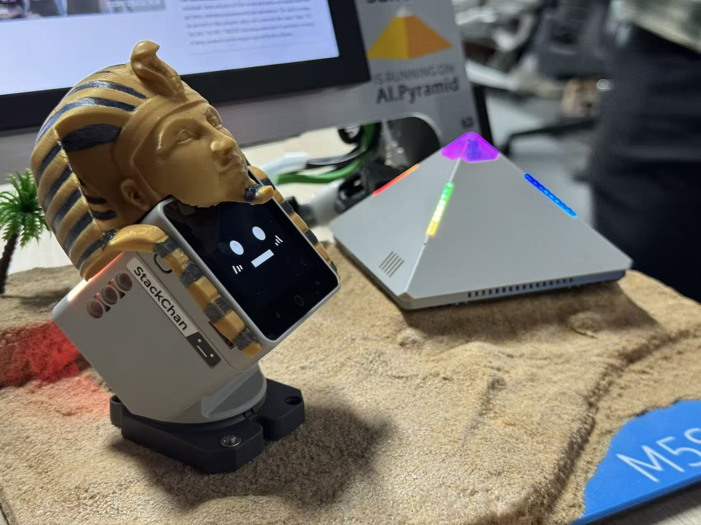
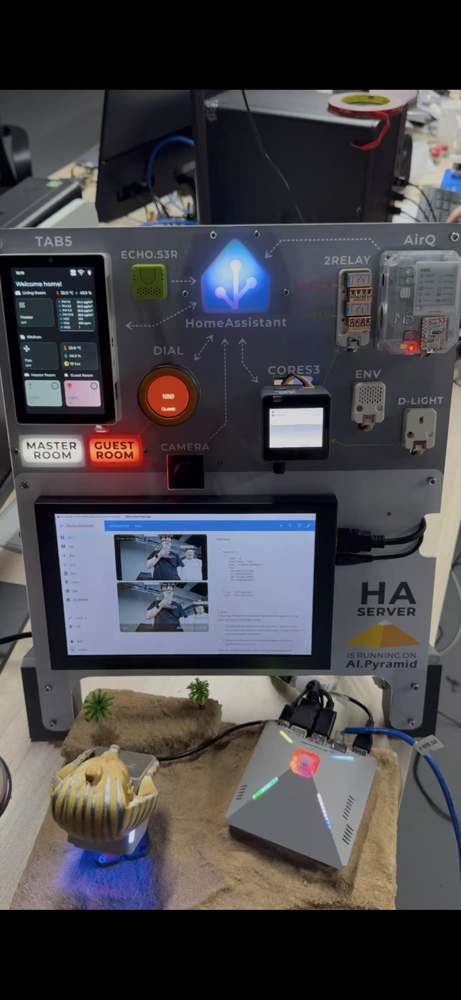

左侧为StackChan，主控ESP32，可爱的桌面机器人；右侧为AI-Pyramid，主控AX8850，为本次demo的计算中心

#### 🚀 M5Stack Edge AI Home Assistant 解决方案 (Demo @ CES)

**1. 核心算力与边缘智能 (The Brain)**  
整个系统的核心是 **M5Stack AI-Pyramid**，它作为本地服务器（HA-Server），在完全离线的情况下运行以下全栈AI服务：

- **大语言模型 (LLM):** 运行 Qwen 0.5B，实现自然语言理解。
- **语音识别 (ASR):** 搭载 SenseVoice，提供高精度语音转文字。
- **视觉大模型 (VLM):** 运行 InternVL3-1B，实现实时画面理解。
- **计算机视觉 (CV):** 部署 YOLO 模型，负责实时的行人与骨骼检测。

**2. 环境感知层 (Sensing)**  
通过 **CoreS3** 作为网关，将各类高精度传感器数据实时接入 HA 并在 **TAB5** 面板呈现：

- **AirQ:** 空气质量监测。
- **ENV Unit:** 温湿度环境监测。
- **D-LIGHT:** 光照强度监测
- （支持自动化联动，如“天黑自动开灯”）

**3. 多模态交互控制 (Control)**  
系统支持触控、旋钮及自动化等多种控制方式：

- **M5 Dial 智能旋钮:** 物理连接 Master/Guest Room Light 及状态灯，支持旋转调光和点击控制。
- **TAB5 中控屏:** 实时同步所有设备状态，提供可视化触控界面。
- **自动化联动:** 基于 HA 逻辑，实现传感器与执行器的自动协同。

**4. 离线自然语言交互 (Offline Voice AI)**  
基于本地 LLM，无需联网即可处理复杂的自然语言指令，支持模糊语义理解与多意图识别：

- **全屋控制:** “关闭所有灯”、“打开所有设备”。
- **复杂连续指令:** “打开风扇，顺便把客房灯调成绿色”（支持跨设备类型的一句话多指令）。
- **自然色彩调节:** 支持如“咖啡色”等非标准颜色的语义理解。
- _注：由于采用纯本地计算，处理连续多设备指令时，每增加一个设备控制，推理耗时约增加 1 秒。_

| 能力维度 (Capability) | 演示指令 (Demo Command) | 技术亮点 (Tech Highlight) |
| :--- | :--- | :--- |
| **模糊语义控制** | “把主卧灯调成**咖啡色**” | 非标准色值的语义映射 |
| **多意图连续指令** | “打开风扇，**顺便**把客房灯调绿” | 单句指令包含多个不同设备的动作 |
| **全局聚合控制** | “关掉家里**所有的东西**” | 实体集合的批量操作 |
| **跨域逻辑执行** | “全灯变暖色，**然后**打开加热器” | 能够理解先后顺序逻辑 (CoT) |

